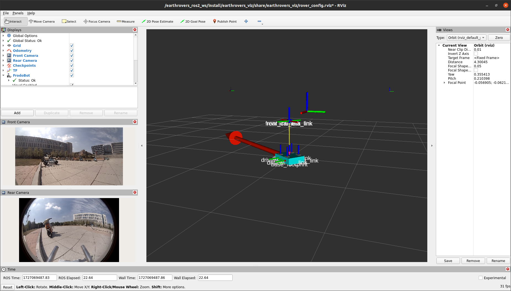

# earthrovers_ros
ROS 2 Wrapper for the FrodoBots Earth Rover SDK



## ROS Packages
This repository is home to a handful of ROS packages, each housing nodes that
allow you to interact with the Earth Rover SDK.

See each package's README for more details on its nodes and the interfaces for
each.
### earthrovers_base
Contains `base` node that publishes imu, gps, and other data from the Earth
Rover SDK's `/data` endpoint.
### earthrovers_bringup
Package to house launch files for bringing up the Earth Rovers ROS stack.
### earthrovers_description
Contains URDF description of the FrodoBot. Used to establish all the static
transforms between the rover's different links/frames.
### earthrovers_interfaces
Contains custom service definitions (that you probably won't ever use).
### earthrovers_navigation
Mainly contains a node (`nav`) for producing "fake" odometry odometry messages derived
from the change in GPS positions. Also contains a node to publish consecutive
mission checkpoints as they are reached (`waypoint_receiver`). Note that any
other node in this package was experimental/not finished.
### earthrovers_vision
Contains a node for grabbing front and rear camera frames from the SDK. Also
provides a basic framework for how you might publish camera parameters if you
have them.
### earthrovers_viz
Houses an RVIZ configuration file for quick and easy visualization.
<!-- 
## Basic Usage
### 1. Clone this repo into a ROS 2 workspace

### 2. Install dependencies with rosdep

### 3. Build the workspace
```
colcon build
```

### 4. Launch the earth rovers stack with launch file
```
ros2 launch earthrovers_bringup rover_bringup_launch.py
```

NOTE: Be sure to start up the Earth Rovers SDK if you have not already. -->

# Running in a Docker Container with Rocker
This repository contains Dockerfiles that should be useful if you're looking to
work on these ROS packages or deploy them in a container.

## Prerequisites
- Docker engine ([installation
  instructions](https://docs.docker.com/engine/install/ubuntu/#install-using-the-repository)
  and [post-install instructions](https://docs.docker.com/engine/install/linux-postinstall/))
- OSRF's rocker ([installation
  instructions](https://github.com/osrf/rocker?tab=readme-ov-file#debians-recommended))
- tmuxp (optional) ([installation
  instructions](https://github.com/tmux-python/tmuxp?tab=readme-ov-file#installation))

Note: rocker is not *absolutely* necessary--but **greatly** simplifies the
process of running a container with all the options you usually want.

## Development Container Setup
If you are looking to make changes / contribute to this package, you can save
yourself a ton of headache by working in a development container.

For now, our development container is very straightforward and simply provides
an Ubuntu FS with ROS desktop installed. The basic idea is that you build our
docker image, create a new container from the image with your workspace added,
use rosdep to install dependencies, set up VSCODE, and you're ready to go.

### 1. Create a new ROS workspace on your host computer
Somewhere on your host, create a new workspace and source directory. Below, we
create a workspace called "earthrovers_ws" in your home directory--but any
folder name placed anywhere should work.
```
mkdir -p ~/earthrovers_ws/src && \
cd ~/earthrovers_ws/src
```

### 2. Clone the Earth Rovers ROS repository into your workspace's src folder
```
git clone https://github.com/castacks/earthrovers_ros.git
```

### 3. Build the development Docker image
In the root of the repository you just cloned, run the following command to
build the development Docker image based on the development Dockerfile.
```
docker build -t earthrovers_development dockerfiles/development
```
### 4. Create development container from the image
First, set an environment variable EARTHROVERS_WS to the path to your local
workspace.
```
export EARTHROVERS_WS=~/earthrovers_ws/src
```
Next, use rocker to create a new container using the docker image we just built:
```
rocker --x11 --user --ssh --privileged --network host --name earthrovers_ros --volume $EARTHROVERS_WS:/earthrovers_ws -- earthrovers_development
```
### 5. Install Earth Rovers ROS package dependencies in container
Next, in order that all the Earth Rovers ROS packages have all the libraries and
packages they need to work properly, we need to install those inside the
container.

To this, first navigate to `earthrovers_ws` directory:
```
cd /earthrovers_ws
```

To do this, run the following commands **in the container**:
```
sudo apt-get update && \
rosdep update --rosdistro $ROS_DISTRO && \
rosdep install --from-paths src -y -r --ignore-src
```

### 6. Build the workspace
Once your workspace is set up with all the Earth Rovers ROS packages, run the
following to build the workspace.
```
colcon build
```

### 7. Launch nodes with tmuxp
When developing a handful of connected ROS nodes, it can often be helpful to run
each one of them in a separate terminal window for easier debugging. If you
optionall installed tmuxp from the above prerequisites list, you can run all the
nodes with the following:

```
tmuxp load /earthrovers_ws/src/earthrovers_ros/tmuxp_configs/dev.yaml
```

### 8. Connect VSCode to your development container
While you can edit the source files with your editor of choice on your host-OS,
your editor likely won't have a way to know how to resolve packages or header
files that your modules / source files are importing that are installed within
the container's filesystem, but not your hosts.

To resolve this, you can actually run a VSCode server from within your
development container and connect your VSCode client to this server. This is all
made very easy by the with the Dev Containers extension that is installed as a
part of the [Remote Development extension pack](https://code.visualstudio.com/docs/remote/remote-overview#_remote-development-extension-pack).

Then, follow [these
instructions](https://code.visualstudio.com/docs/devcontainers/attach-container)
from the [devcontainers
documentation](https://code.visualstudio.com/docs/devcontainers/containers) to
attach your VSCode client to the VSCode server running in your container.
